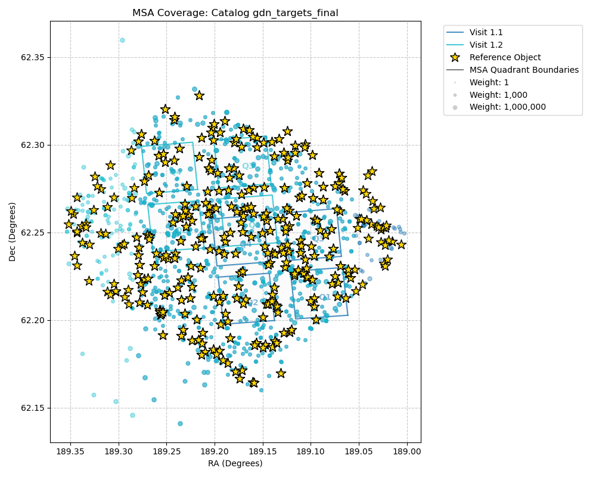

# NIRSpec MOS APT Review Assistant

`APT_review.py` aids Instrument Scientists in reviewing NIRSpec MOS programs by extracting information from an APT file `.aptx` and generating an ASCII report `.txt` and optional plots `.png`, including:
* APT warnings and errors
* MSATA reference stars used and quads covered (reported and plotted)
* Depth and wavelength coverage of high-priority targets
* Exposure specifications (gratings, integration times, readout patterns, etc.)
* Aperture PA planned vs. assigned
* Total Charged Time vs. Allocated
* and more...

---

## Example Report

`python3 APT_review.py JWST7729.aptx`

generates:

* report: [**JWST7729_review.txt**](docs/JWST7729_review.txt)
* plots: [**msa_coverage_*.png**](docs/JWST7729_msa_coverage.png)

### Example Report Excerpts

from [**JWST7729_review.txt**](docs/JWST7729_review.txt) that provides many more details

```
✅ 67.0 Hours Total Charged / 67.6 Hours Allocated
2 observations: 1, 2

🔎 1 observation reviewed: Obs 1
✅ Aperture PA Planned = Assigned
🌔 MSATA: 6-8 stars in 2-3 quads
✅ Catalogs: 2 catalogs: gdn_targets_final, msa_targets_gds
⚠️ IRS2 Readout NOT used in Obs 1
✅ Integration times all 429.5 s (< 1500 s)
✅ Nod Pattern: 3 Shutter Slitlet

👷 1 observation under construction: Obs 2
```



---

## Documentation

| File | Purpose |
|------|---------|
| `docs/APT_report.md` | Full technical reference describing every metric extracted, where it comes from, and how the report is structured. |
| `docs/APT_XML.md` | Reference for the APT XML schema — where specific data lives in the XML tree. |
| `docs/APT_exports.md` | Guide to the supplementary CSV exports (MSATA, Wavelengths) and how the script finds them. |
| `docs/Plots.md` | Reference for interpreting the MSA coverage plots (colors, outlines, and dispersion). |
| `docs/ReviewChecklist.md` | Human-facing review checklist used alongside the automated report. |
| `docs/ChangeLog.md` | Historical log of updates and new features added to the tool. |

---

## Files and Dependencies

### Core Files
*   **`APT_review.py`**: The primary script. It handles XML parsing, catalog checks, and report generation using only the **Python Standard Library**.

### OPTIONAL
*   **`msa_coverage_plot.py`**: Plots NIRSpec MSA quadrants overlaid on catalogs.

To enable **(OPTIONAL) plot generation**, you need the following:

| Package | Purpose |
|---------|---------|
| `pysiaf` | Plotting NIRSpec MSA quadrants. |
| `numpy` | Coordinate calculations (required by PySIAF). |
| `matplotlib` | Creating the `msa_coverage_*.png` plots. |
| `pandas` | Data handling for CSV plotting. |

```bash
pip install numpy matplotlib pandas pysiaf
```

---

## Quick Start

### 1. Run the review script

```bash
python APT_review.py /path/to/program.aptx
```

The report is output to the Terminal and saved to `<filename>_review.txt` in the same directory (e.g., `program_review.txt`).

### 2. Supplement with CSV exports

The script automatically finds relevant CSV files (MSATA Target Info, Wavelength Coverage) if they are in a subfolder next to the APT file or in your current directory. You can also specify a directory explicitly:

```bash
python APT_review.py program.aptx --exports ./my_exports/
```

### 3. Override the output path

```bash
python APT_review.py /path/to/program.aptx --output my_report.txt
```

### 3. Review only specific observations

By default, the script **excludes observations with a `COMPLETED` status** in APT.

```bash
# Review only observation 3 (even if COMPLETED)
python APT_review.py program.aptx --obs 3

# Review a specific list/range
python APT_review.py program.aptx --obs "1,3-5,10"

# Exclude specific observations from the active set
python APT_review.py program.aptx --exclude "2,6-8"
```

---

## What the Report Covers

The report is organized into 18 sections that are printed in sequence:

1.  **Review Header** — Program title, PI, and PID.
2.  **Observing Description** — High-level summary from the proposal.
3.  **Observation Summary Table** — A program-wide status list using emojis to indicate:
    - 🔎 Included for review
    - 👷 Not yet designed? (Aperture PA mismatch)
    - ☑️  COMPLETED (finished in APT)
    - 🙈 Excluded (filtered or skipped)
    - 🤷🏻 Not reviewed (different instrument mode)
4.  **Submission Details** — APT version, submission comments, diagnostic justifications, and submission log.
5.  **Detailed Findings** — Observation-specific warnings and errors (e.g. TA method, exposure duration, non-IRS2 readout).
6.  **Aperture PA Summary** — Compares the Planned PA (from the MPT JSON) against the Assigned PA (from the Visit Planner diagnostics).
7.  **Exposure Specifications** — All grating/filter, readout, and group/integration settings.
8.  **Configurations / Pointings** — Every telescope pointing, nod pattern, and total time on sky.
9.  **Parallels & Dithers** — Which observations are coordinated parallels and whether dithering is compatible.
10. **Special Requirements** — Orientation constraints, background limits, and other flags.
11. **MSA Configurations & Strategy** — Slitlet counts, primary/filler breakdown, and whether Leakcal and Confirmation Images are enabled.
12. **MSATA & Reference Stars** — Detailed breakdown of reference stars *used* (from TA CSV) and *available* (calculated via **PySIAF**), including quadrant coverage.
13. **Target Catalog** — Source counts, reference-star counts, astrometric accuracy, and weight filters per catalog.
14. **High Priority Targets** — Per-visit coverage analysis for the top 20 weighted targets, identifying detector gaps and spectral cutoffs.
15. **Target Catalog Errors/Warnings** — Detailed warnings for specific catalogs (e.g. IDs, stellarity).
16. **Final Summary** — A concise technical sign-off including time budget and compliance for MSATA, Integration Times, and IRS2.
17. **SPAR Review** — A consolidated checklist format review (as seen in `docs/JWST7729_review.md`).
18. **Files Used** — A log of every `.aptx`, `.xml`, and `.csv` file contribution to the report.

---

## Input File Formats

| Format | Notes |
|--------|-------|
| `.aptx` | Standard APT export (ZIP archive containing XML + JSON files). **Recommended.** |
| `.xml` | Raw XML only. MPT JSON plans will not be found unless placed in a `json_temp/` subfolder next to the XML. |
| `.csv` | **Supplementary.** Exported via APT (File -> Export -> MSA Target Info, Wavelength Coverage, or Visits). Used for TA ref star, detector gap, and quadrant geometry analysis. |

### Automatic Supplementary File Search
The script automatically searches for supplementary files to enhance its analysis:

*   **MPT JSON Plans (`.json`)**: Searched for specifically in a `json_temp/` directory adjacent to the APT file (or inside `[program_name]/json_temp/`).
*   **CSV Exports (`*-TA.csv`, `*-obs*.csv`, `*_visits.csv`)**: Searched for in `exports/`, the current directory, and **any immediate subdirectory** of either the APT parent folder or the current directory.

You can override the search path for CSVs using the `--exports` flag.

---

## Key Checks Performed

| Check | Threshold / Expectation |
|-------|------------------------|
| TA Method | Should be `MSATA` |
| Reference Stars | ≥ 7 committed stars (WARNING < 7, ERROR < 5) |
| Quadrant Coverage | ≥ 3 quadrants preferred (Calculated via **PySIAF** from `visits.csv`) |
| Integration Time | < 1500 s per integration recommended |
| Readout Pattern | IRS2 (`NRSIRS2RAPID`) preferred for all MOS exposures |
| Astrometric Accuracy | < 15 mas recommended |
| Catalog IDs | IDs ≥ 1,000,000 may cause MPT issues |
| Clustering | Observations within 1.5° should be checked for field/angle shared efficiency |
| Cross-Instrument Links | FS+MOS Requires Angle SR; MOS+NIRCam Requires Timing SR |
| Parallels | Parallel observations should use `JOINT` dither types |
| Aperture PA | Planned (JSON) vs. Assigned (VP) values should agree at the observation level |

---

## What Requires Your Judgment

The script automates the tedious data extraction, but it is **not a substitute for reviewer expertise**. You still need to think critically about:

| | Item | Why it needs human eyes |
|-|------|--------------------------|
| 🧠 | **Special Requirements** | Whether the constraints (orientation, timing, background) are scientifically justified and not over-constrained |
| 🧠 | **Backgrounds** | Whether the background-limited requirement is appropriate for the science case and the expected zodiacal/thermal background at the chosen epoch |

## What Must Be Checked Manually

| | Item |
|-|------|
| 👁️ | **Bright sources** — visually inspect the field with Aladin |
| 👁️ | **MSA well filled?** — assess whether the MPT plan makes efficient use of the MSA field; the script does report how many targets are observed |
| 👁️ | **Exposure depth on primary targets** — ensure those get full depth |
| 👁️ | **Spectral wavelength cutoffs** — confirm the chosen grating/filter covers the lines of interest for primary targets |

---

## Further Reading

*   **[APT_report.md](docs/APT_report.md)** — detailed mapping of every extracted field to its XML/JSON source.
*   **[APT_XML.md](docs/APT_XML.md)** — APT XML schema reference.
*   **[APT_exports.md](docs/APT_exports.md)** — Guide to the supplementary CSV exports and PySIAF integration.
*   **[ReviewChecklist.md](docs/ReviewChecklist.md)** — the full manual review checklist.
*   **[SpotlightChecklist.md](docs/SpotlightChecklist.md)** — technical checklist focused on modern MOS bottlenecks (clustering, timing, strategy).
