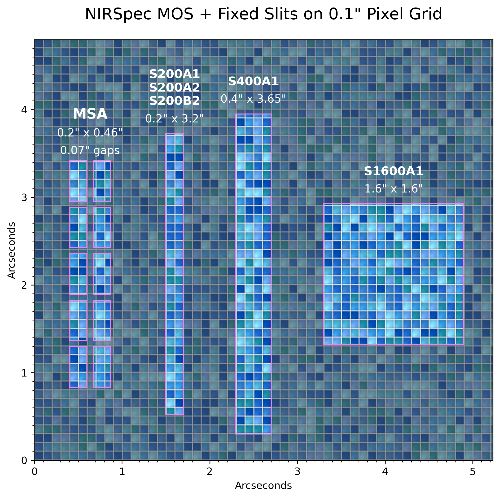

# NIRSpec Slits on Pixels

This script dives in to the JWST NIRSpec MOS and Fixed Slits, plotting them to scale overlaid on the 0.1" detector pixels illustrated as pool tiles. 




## Slit Dimensions

| Aperture | Width (") | Height (") | Notes |
| :--- | :--- | :--- | :--- |
| MSA Shutter | 0.20 | 0.46 | 0.07" gaps |
| S200A1, S200A2, S200B2 | 0.20 | 3.20 | Fixed slits |
| S400A1 | 0.40 | 3.65 | Fixed slit |
| S1600A1 | 1.60 | 1.60 | Square aperture |

See documentation on JDox for:
* [Fixed Slits](https://jwst-docs.stsci.edu/jwst-near-infrared-spectrograph/nirspec-instrumentation/nirspec-fixed-slits)
* [Multi-Object Spectroscopy (MOS)](https://jwst-docs.stsci.edu/jwst-near-infrared-spectrograph/nirspec-observing-modes/nirspec-multi-object-spectroscopy)


## Usage

Ensure you have `matplotlib` and `numpy` installed:

```bash
pip install matplotlib numpy
```

Run the generator script:

```bash
python plot_nirspec_slits.py
```

To customize the layout or style, you can modify the call in the `if __name__ == "__main__":` block:

```python
plot_combined_slits(mos_rows=5, mos_cols=5, style='pixel')
```

This will produce a high-resolution PNG file named `nirspec_slits.png`.

## Options

The `plot_combined_slits` function in `plot_nirspec_slits.py` can be customized with the following arguments:

| Argument | Default | Description |
| :--- | :--- | :--- |
| `mos_rows` | `5` | Number of MSA shutters in the vertical array. |
| `mos_cols` | `2` | Number of MSA shutters in the horizontal array. |
| `style` | `'mosaic'` | Visual style: `'mosaic'` (pool tiles) or `'pixel'` (random blue pixels). |


