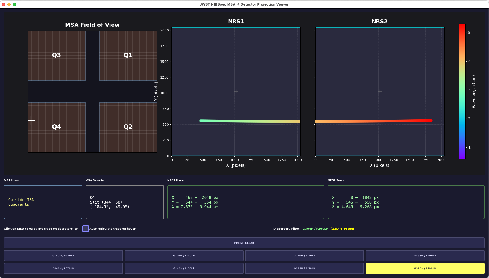

# JWST NIRSpec MSA ➡ Detector Trace Plotter

Interactive plotter for JWST NIRSpec MOS observations (multi-object spectroscopy)

* Select: MSA (Micro-Shutter Assembly) quadrant & slit
* See: detector pixel traces with wavelength color-coding
    * calculated using the JWST pipeline (required)



## Features

- **Interactive MSA View**: Click or hover your mouse over the MSA footprint to select positions
- **Real-time Detector Projection**: See where the spectrum lands on NRS1 and NRS2 detectors
- **Wavelength Color-Coding**: Spectral traces are color-coded by wavelength (rainbow colormap)
- **Multiple Gratings/Dispersers**: Switch between different gratings (PRISM, G395H, G235M, G140H)
- **Accurate Geometry**: 
  - MSA: 4 quadrants (Q1-Q4), total FOV ~3.6' × 3.4'
  - Detectors: 2048×2048 pixels each
  - Proper quadrant layout matching JWST orientation

## Installation

### Requirements
- **[JWST Pipeline](https://github.com/spacetelescope/jwst-pipeline-notebooks)**
- Python 3.7+
- PyQt5
- NumPy
- Matplotlib

> **Important**: The JWST pipeline is a required dependency for proper spectral trace modeling and wavelength calibration. It provides access to reference files and calibration data essential for accurate MSA-to-detector projection calculations.

### Setup

1. Install the JWST Pipeline (required):
```bash
pip install jwst
```

2. Install dependencies:
```bash
pip install -r requirements.txt
```

Or install individually:
```bash
pip install PyQt5 numpy matplotlib jwst
```

## Usage

Run the application:
```bash
python nirspec_msa_viewer.py
```

### Controls

1. **Mouse Hover**: Move your mouse over the MSA panel on the left to select a position
2. **Grating Selector**: Use the slider at the bottom of the MSA panel to change the grating/disperser:
   - PRISM: 0.6-5.3 μm (broadband)
   - G395H: 2.9-5.0 μm (high resolution)
   - G235M: 1.7-3.1 μm (medium resolution)
   - G140H: 1.0-1.8 μm (high resolution)

### Interface Layout

```
┌─────────────────────────────────────────────────────────┐
│  NIRSpec MSA (left)        Detectors (right)           │
│  ┌─────────────┐          ┌──────────┬──────────┐      │
│  │    Q3  Q1   │          │  NRS1    │  NRS2    │      │
│  │             │    →     │          │          │      │
│  │    Q4  Q2   │          │  ████    │          │      │
│  └─────────────┘          └──────────┴──────────┘      │
│  [Grating: ____|____]                                  │
└─────────────────────────────────────────────────────────┘
```

## Technical Details

### MSA Geometry
- **Total Field of View**: 3.6' × 3.4' (216" × 204")
- **4 Quadrants**: Each 365×171 shutters
- **Shutter Size**: 0.20" × 0.46" (dispersion × spatial)
- **Gaps**: 23" (dispersion) × 37" (spatial) between quadrants

### Detector Layout
- **Two detectors**: NRS1 and NRS2
- **Size**: 2048 × 2048 pixels each
- **Pixel scale**: 0.1" per pixel
- **Physical gap**: ~30 arcsec between detectors

### Spectral Projection
The application uses a simplified geometric model for the spectral trace projection:
- **Dispersion axis**: Primarily horizontal (X direction on detector)
- **Spatial axis**: Primarily vertical (Y direction on detector)
- **Wavelength mapping**: Shorter wavelengths → lower X, longer wavelengths → higher X
- **MSA position effects**: 
  - X position shifts the trace horizontally
  - Y position shifts the trace vertically

### Color Coding
Wavelengths are mapped to colors using a rainbow colormap:
- **Blue/Purple**: Shorter wavelengths (~1 μm)
- **Green/Yellow**: Mid wavelengths (~3 μm)
- **Red/Dark Red**: Longer wavelengths (~5 μm)

## References

- [JDox](https://jwst-docs.stsci.edu/)
    - [NIRSpec MOS](https://jwst-docs.stsci.edu/jwst-near-infrared-spectrograph/nirspec-observing-modes/nirspec-multi-object-spectroscopy)
    - [NIRSpec MSA](https://jwst-docs.stsci.edu/jwst-near-infrared-spectrograph/nirspec-instrumentation/nirspec-micro-shutter-assembly)
- [Jakobsen et al. 2022, A&A 661, A80](https://ui.adsabs.harvard.edu/abs/2022A%26A...661A..80J)

## License

This tool is provided for to support JWST observers. JWST and NIRSpec are operated by NASA, ESA, and CSA.

## Author

Dan Coe for the JWST NIRSpec Instrument Team at STScI.
