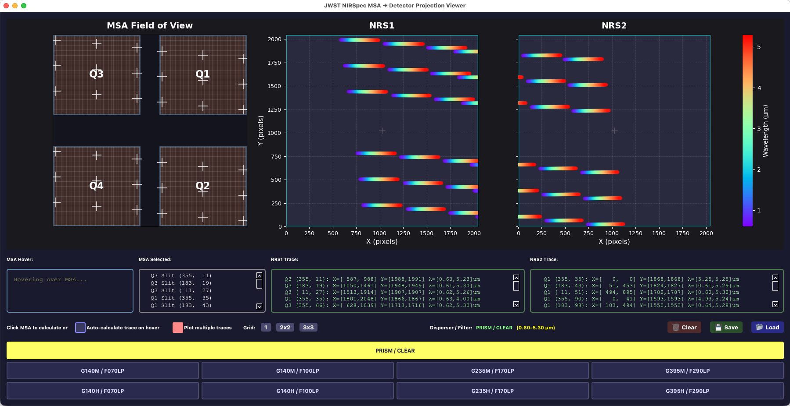

# MOS trace interactive viewer

## JWST NIRSpec MSA ➡ Detector Trace Plotter

> **CAUTION**: The outputs of this tool (spectral trace positions and wavelength calibrations) have yet to be rigorously tested and cross-verified against official ground-truth data. Use for visualization and planning purposes only.

Interactive plotter for JWST NIRSpec MOS (multi-object spectroscopy) observations

* Select: shutter (quadrant, row, and column) on the MSA (Micro-Shutter Assembly)
* See: detector pixel traces on NRS1 and NRS2 with wavelength color-coding
    * calculated using the JWST pipeline (required)



## Features

- **Interactive MSA View**: Click or hover your mouse over the MSA footprint to select shutters.
- **Multi-Trace Mode**: Plot dozens of spectral traces simultaneously to check for overlaps.
- **Auto-Add Patterns**: Automatically generate 1 (centers), 2x2 (corners), or 3x3 (grid) shutter patterns across the FOV.
- **Save & Load Shutters**: Save shutters and result summaries to CSV files. (Full traces are not saved and must be recomputed.)
- **Wavelength Color-Coding**: Spectral traces are color-coded by wavelength (rainbow colormap).
- **PRISM / Gratings & Dispersers**: Switch between PRISM and gratings (G140M/H, G235M/H, G395M/H)

## Installation

### Requirements
- **[JWST Pipeline](https://github.com/spacetelescope/jwst-pipeline-notebooks)**
- PyQt5
- Python 3.7+
- NumPy
- Matplotlib

> **Important**: The JWST pipeline and CRDS reference files are required to calculate spectral traces.

### Setup

#### Option 1: Using Micromamba/Conda (Recommended)
This is the most robust way to manage the complex dependencies (especially Qt and the JWST pipeline).

```bash
# 1. Create a dedicated environment with core binary dependencies
micromamba create -n mos_trace python=3.12 numpy matplotlib scipy astropy pyqt -c conda-forge

# 2. Activate the environment
micromamba activate mos_trace

# 3. Install the remaining JWST pipeline packages
pip install jwst stdatamodels gwcs
```

#### Option 2: Using Pip individually
If you prefer not to use a virtual environment manager:

```bash
pip install PyQt5 numpy matplotlib scipy astropy jwst stdatamodels gwcs
```

## Usage

Run the application to launch the interactive viewer:
```bash
python3 mos_trace.py
```

### Controls

1. **Click to Add**: Click anywhere on the MSA to lock a shutter position and add it to your list.
2. **Auto-calculate on hover**: (Checkbox) When enabled, moving the mouse over the MSA updates the detector trace live. Performance may be slow.
3. **Plot multiple traces**: (Checkbox) Option to plot multiple traces or one at a time.
4. **Automatic Grids (1, 2x2, 3x3)**: Understand the geometry by plotting multiple traces from a grid of shutters. Adjust **Buffer** (distance from edge) and **Stagger** (vertical shift to avoid overlap) in the popup.
5. **Save / Load / Clear**: Save shutters and result summaries to a CSV file. Reload shutters and recalcuate traces. Clear (reset) all shutters and traces.
6. **Grating Selectors**: Use the grid of buttons to switch between dispersers (PRISM, High-res H, Medium-res M).

## Terminal Command Line Interface (CLI)
For quick trace calculations in the Terminal without launching the GUI:
```bash
# Basic usage (defaults to PRISM/CLEAR)
python3 mos_trace.py Q3 319 108

# Specify a configuration (G395H, G140M, etc.)
python3 mos_trace.py G395H Q3 319 108

# Specify an explicit grating/filter pair
python3 mos_trace.py G140M/F070LP Q3 319 108

# Use compact shutter ID format
python3 mos_trace.py q3d319s108

# Process a CSV file (auto-detects grating/filter from filename)
python3 mos_trace.py traces/4246/4246-obs3-exp1-c1e1n1-G395H-F290LP.csv

# Process a CSV file with an explicit grating/filter override
python3 mos_trace.py PRISM traces/test.csv

# Process a CSV and save results (the -save flag MUST be at the end)
python3 mos_trace.py PRISM data.csv -save results.csv
```

### Save Results as Output CSV
When saving results (via the GUI or `-save` CLI flag), the tool generates a CSV with the following column structure:

- **Instrument Info**: `Grating`, `Filter`
- **Shutter Info**: `Quadrant`, `Column (Disp)`, `Row (Spat)`, `MSA_X_arcsec`, `MSA_Y_arcsec`
- **Calculated Results**:
    - **Wavelengths**: `NRS1/2 Min λ (calc)`, `NRS1/2 Max λ (calc)`
    - **Detector Ranges**: `NRS1/2 Min/Max X/Y (calc)` (pixel coordinates 0-2048)
- **Comparison Data** (Batch mode only): `NRS1/2 Min λ (diff)`, `NRS1/2 Min λ (sym)`, etc.

### Input CSV File: Batch Processing
When an input CSV file is provided (from this script or APT, for example), the script iterates through each row to calculate spectral traces.
- **Auto-Configuration**: Grating and filtering are automatically inferred from the CSV filename (e.g., `G395H` and `F290LP` found in the name).
- **Wavelength Comparison**: Calculated trace wavelength ranges are compared against `NRS1/2 Min/Max Wave` columns if present in the CSV.
- **Comparison Symbols**:
    - ✅ : (≤ 0.01 µm) **Match** 
    - 🔰 : (≤ 0.02 µm) **Minor Variance**
    - 〽️ : (≤ 0.03 µm) **Small Variance**
    - ⚠️ : (≤ 0.05 µm) **Medium Variance**
    - 🔶 : (≤ 0.10 µm) **Large Variance**
    - ❌ : (> 0.10 µm) **Mismatch**
- **Special Markers**: The script recognizes special markers in the CSV:
    - `–1.00`: Off the blue (short wavelength) end of the detector.
    - `–2.00`: Off the red (long wavelength) end of the detector.

### Accuracy

In our spot testing with APT (File – Export – MSA Target Info [.csv]) we find that the traces are generally accurate to within 0.01 µm with gratings and 0.1 µm with PRISM.

## Technical Details

### MSA Geometry
- **Field of View**: 3.6' × 3.4' (216" × 204")
- **4 Quadrants**: Each 365 × 171 shutters (~250,000 total)
- **Shutter Size**: 0.20" × 0.46" (dispersion × spatial)
- **Gaps**: 23" (dispersion) × 37" (spatial) between quadrants

### Detector Layout
- **Two detectors**: NRS1 and NRS2
- **Pixels**: 2048 × 2048 pixels each
- **Pixel scale**: 0.1" / pixel
- **Physical gap**: ~30" between detectors

### Color Coding
Wavelengths are mapped to colors using a rainbow colormap:
- **Purple/Blue**: Shorter wavelengths (~1 μm)
- **Green/Yellow**: Mid wavelengths (~3 μm)
- **Orange/Red**: Longer wavelengths (~5 μm)

## References

- [JDox](https://jwst-docs.stsci.edu/)
    - [NIRSpec MOS](https://jwst-docs.stsci.edu/jwst-near-infrared-spectrograph/nirspec-observing-modes/nirspec-multi-object-spectroscopy)
    - [NIRSpec MSA](https://jwst-docs.stsci.edu/jwst-near-infrared-spectrograph/nirspec-instrumentation/nirspec-micro-shutter-assembly)
- NIRSpec: [Jakobsen et al. 2022, A&A 661, A80](https://ui.adsabs.harvard.edu/abs/2022A%26A...661A..80J)
- MOS: [Ferruit et al. 2022, A&A 661, A81](https://ui.adsabs.harvard.edu/abs/2022A%26A...661A..81F)

## License

This tool is provided for to support JWST observers. JWST and NIRSpec are operated by NASA, ESA, and CSA.

## Author

Dan Coe for the JWST NIRSpec Instrument Team at STScI.
