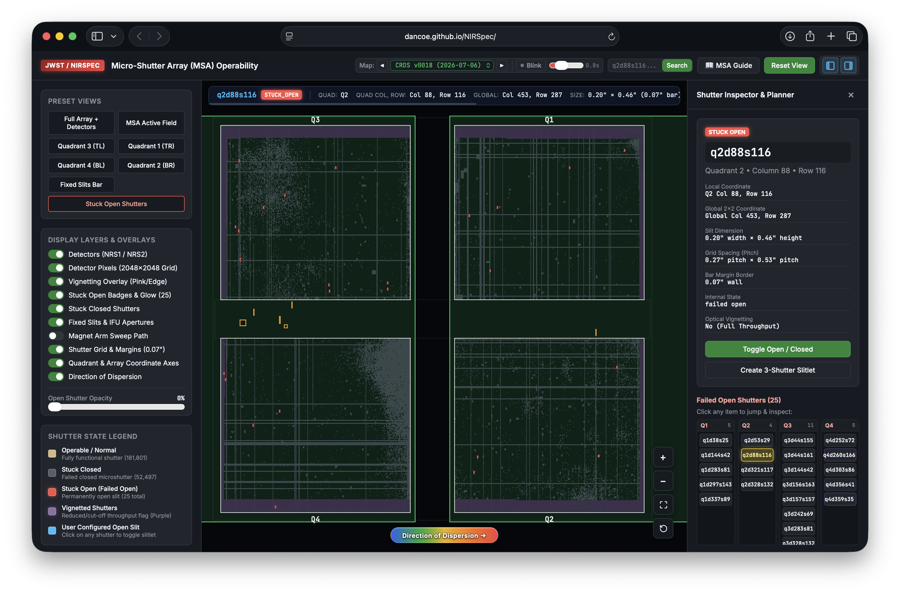

# JWST NIRSpec MSA Operability & Geometry Visualizer

An interactive high-performance web application to explore the James Webb Space Telescope (JWST) Near-Infrared Spectrograph (NIRSpec) **Micro-Shutter Array (MSA)** operability, shutter states, quadrant mapping, and detector layout geometry.

<p align="center">
  
</p>

---


## Key Features

1. **Interactive High-Performance Canvas Engine**:
   - Smooth 60fps pan and continuous zoom across all **249,660 microshutters** ($4 \times 365 \times 171$).
   - Level-of-Detail (LOD) rendering supporting everything from full focal-plane view down to single-shutter dimensions ($0.20'' \times 0.46''$ with $0.07''$ margins).

2. **Dual Coordinate Mapping**:
   - **Quadrant Coordinates**: $(Q, \text{Col}_{1..365}, \text{Row}_{1..171})$ centered according to NIRSpec instrument convention (Q3 Top-Left, Q1 Top-Right, Q4 Bottom-Left, Q2 Bottom-Right).
   - **Global Array Coordinates**: Unified coordinate space across the full $2 \times 2$ quadrant grid ($730 \times 342$).
   - Standard MPT shutter IDs (e.g. `q2d88s116`, `q1d38s25`).

3. **Operability & Vignetting Physics**:
   - Parsed from the official CRDS operability file (`data/jwst_nirspec_msaoper_0018.json`).
   - Visual breakdown of operable shutters, stuck closed shutters ($52,497$), stuck open shutters ($25$), and vignetted regions ($24,024$).
   - Direct jump list to all known on-orbit stuck open shutters.

4. **Detector & Instrument Layout Overlays**:
   - Relative geometry of the two Hawaii-2RG detectors (**NRS1** and **NRS2**) with the $\sim 18''$ detector gap.
   - Explains the physical basis for optical vignetting where array perimeters exceed detector coverage.
   - Fixed slits (S200A1, S200A2, S400A1, S1600A1, S200B1) and IFU aperture location markings.
   - Magnet arm sweep line and park positions.
   - Direction of dispersion indicator.

5. **Slit Planning Simulation**:
   - Click on any shutter to toggle open/closed slit configurations or generate standard 3-shutter nod slitlets.

---

## Quick Start / Running Locally

To run the application locally, start any local HTTP server in the repository root:

```bash
# Using Python 3 built-in HTTP server:
python3 -m http.server 8000

# Then open in your browser:
open http://localhost:8000
```

---

## Project Structure

```
.
├── index.html                           # Main web application entry point
├── app.js                               # High performance Canvas rendering & geometry logic
├── style.css                            # Modern dark theme UI styles
├── MSA.md                               # Comprehensive scientific documentation on MSA & detectors
├── README.md                            # Basic functionality & user guide
├── data/
│   ├── jwst_nirspec_msaoper_0018.json   # Original CRDS reference operability dataset
│   └── msa_compact.json                 # Fast-loading compressed binary operability map
└── screenshots/                         # Reference instrument & screenshot figures
```

---

## Controls & Shortcuts

| Action | Control |
| :--- | :--- |
| **Pan / Drag** | Click & Drag with mouse or finger touch (natural 1:1 motion) |
| **Zoom In / Out** | Mouse Wheel (gentle speed) or `+` / `−` keys / on-screen buttons |
| **Reset View (Zoom & Pan)** | **`R` key** or bottom-right reset icon button / top **Reset View** |
| **Switch Operability Map** | **Left Arrow (`←`)** / **Right Arrow (`→`)** keys or top dropdown / `◀` `▶` buttons |
| **Toggle Auto Blink** | **Spacebar** or top **Blink** button |
| **Select / Deselect Shutter** | Left Click on any microshutter (hover alone does not select) |
| **Search Shutter** | Enter ID in top search box (e.g. `q2d88s116` or `Q1 38 25`) and press Enter |
| **Toggle Slit State** | Select a shutter and click **Toggle Open / Closed** |

